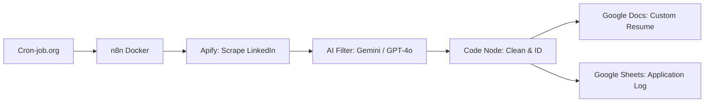

# Sleepless — AI Job Application Automation <sup>_(WIP)_</sup>

An automated pipeline that scrapes LinkedIn job postings, filters them against your profile, and generates tailored resumes — all running on a self-hosted n8n instance.

## How It Works



1. **Schedule Trigger** — Cron-job.org pings n8n daily to keep it alive (Render free tier sleeps after 15 min)
2. **Apify Actor** — Scrapes hundreds of LinkedIn job postings
3. **AI Filter** — Gemini (or GPT-4o) checks relevance against your resume
4. **Code Node** — Cleans messy descriptions, generates a unique `Company+Title+Date` ID
5. **Google Docs** — Writes a custom HTML resume tailored per job
6. **Google Sheets** — Persists every application as a row (the only durable storage, since Docker on Render has no persistent disk)

## Tech Stack

| Component | Tool |
|---|---|
| Automation Engine | [n8n](https://n8n.io) (self-hosted Docker) |
| Web Scraping | [Apify](https://apify.com) — LinkedIn Jobs actor |
| AI / LLM | Google Gemini (with OpenAI GPT-4o fallback) |
| Documents | Google Docs API |
| Database | Google Sheets (and n8n SQLite) |
| Scheduling | Cron-job.org |
| Hosting | Render (free tier, Docker) |

## Local Setup

```bash
# 1. Clone and enter
git clone <repo>
cd Sleepless

# 2. Start n8n
chmod +x run.sh && ./run.sh

# 3. Open http://localhost:5678
#    The workflow and credentials are bundled in n8n_data/ as you add them in the interface during configuration
```

## Credentials

All API keys (Apify, Gemini, Google OAuth) live inside n8n's credential store in `n8n_data/`.

| Credential | n8n Credential Type | Purpose |
|---|---|---|
| Apify API Key | `apifyOAuth2Api` | LinkedIn scraping |
| Gemini API Key | `googlePalmApi` | Job relevance filtering |
| Google OAuth 2.0 | `googleDriveOAuth2Api` | Drive, Docs, Sheets access |

## Scripts

- **`run.sh`** — Launches n8n Docker container (port 5678, volume `n8n_data`)
- **`backup.sh`** — Stops the container and copies the Docker volume to the repo

## Project Structure

```
Sleepless/
├── run.sh                  # Docker launch script
├── backup.sh               # Volume backup script
├── .env                    # Secrets (gitignored)
└── n8n_data/               # Docker volume backup
    └── _data/
        ├── config          # n8n encryption key
        ├── database.sqlite # Workflow & execution data
        └── storage/        # Binary data (PDFs, etc.)
```
